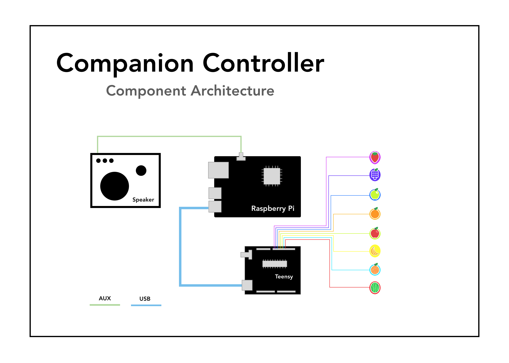
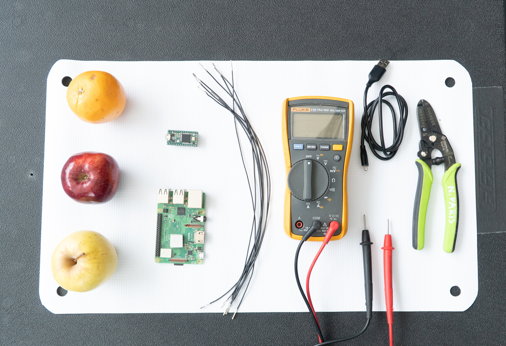
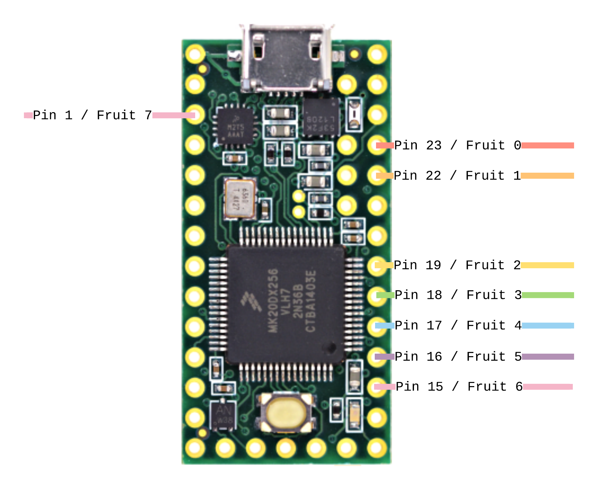
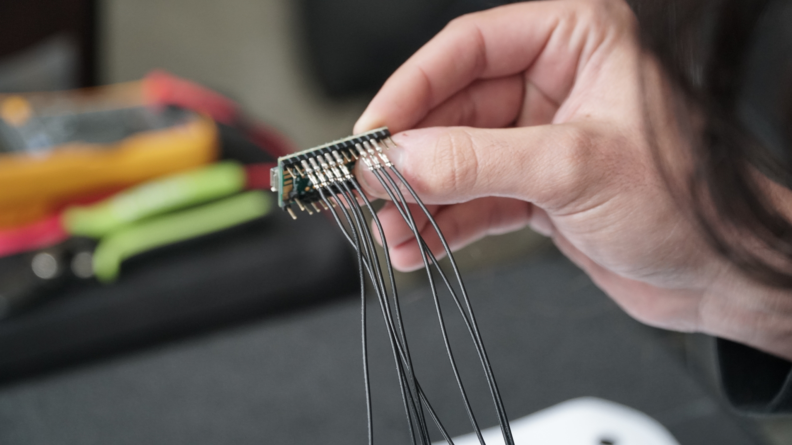
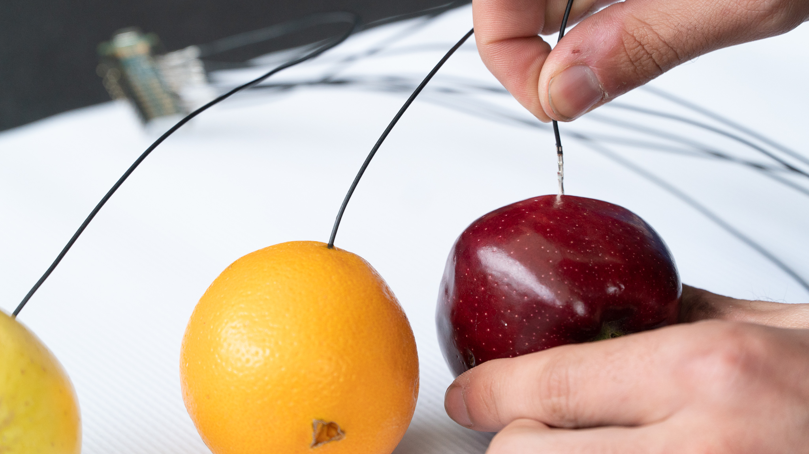
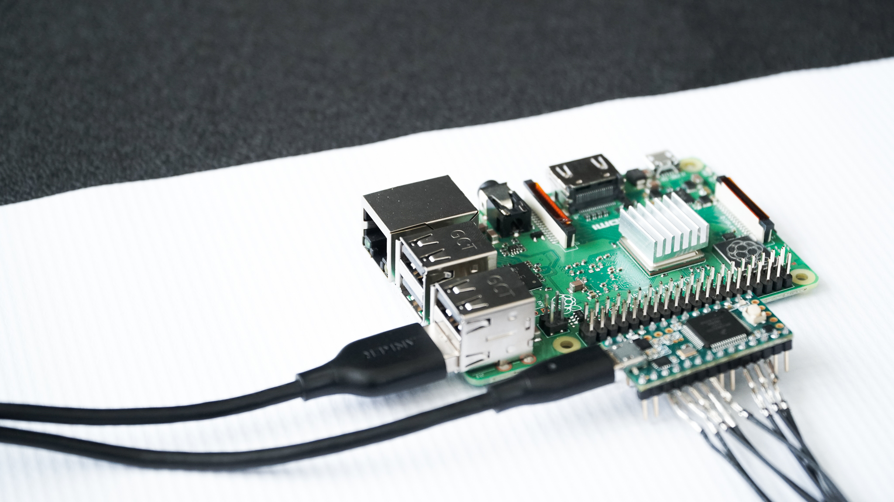

# Fruit Genie

**Disclaimer:** THESE INSTRUCTIONS ARE BEING PROVIDED FOR INFORMATIONAL PURPOSES ONLY AND ARE NOT INTENDED TO BE USED FOR THE PRODUCTION OF COMMERCIAL PRODUCTS.  BY EXECUTING THESE INSTRUCTIONS, YOU AGREE TO ASSUME ALL LIABILITY IN CONNECTION WITH YOUR BUILDING AND USE OF ANY DEVICE. DEEPLOCAL DISCLAIMS ALL WARRANTIES EXPRESS OR IMPLIED WITH RESPECT TO THESE INSTRUCTIONS AND ANY RESULTING DEVICE INCLUDING BUT NOT LIMITED TO WARRANTIES FOR MERCHANTABILITY, FITNESS FOR ANY PARTICULAR PURPOSE, AND NON-INFRINGEMENT.  YOU SHOULD USE EXTREME CAUTION WHEN BUILDING AND USING ANY DEVICE PURSUANT TO THESE INSTRUCTIONS.  IN NO EVENT SHALL DEEPLOCAL BE LIABLE FOR ANY CLAIM OR DAMAGES, INCLUDING BUT NOT LIMITED TO CLAIMS OR DAMAGES RELATED TO DEATH OR PERSONAL INJURY, PROPERTY DAMAGE, OR PRODUCT LIABILITY.

## From I/0 2019 to You

During I/O 2019, the Flaming Lips [played an ML-powered bowl of fruit](https://www.stereogum.com/2043070/watch-the-flaming-lips-play-a-bowl-of-fruit-at-google-io/video/) as part of their performance. 

While you can play with an [awesome online version of Piano Genie here](https://piano-genie.glitch.me/), there’s something special about making music in a tactical way.  To that end, we wanted to share the instructions for you to be able to build your own “Fruit Genie” -- and you could even swap out the produce for buttons if you want to.  

This will get you to the point where you can play the Fruit Genie and output audio from a Raspberry Pi.  From there you’ll be able to extend it to send MIDI to your DAW, or anything you would like.  A Raspberry Pi isn’t necessary either -- you should be able to get this running on any laptop or computer that can run Node and has a USB port.

## System Overview

Our Fruit Genie setup is comprised of three main components:  

 1. A Teensy dev board which handles detecting touches and sending them to our software.

 2. A Raspberry Pi running a Node app that takes those touches, sends them to the Piano Genie software, and plays notes.

 3. Fruit!

## What You'll Need

### Tools
* Wire Strippers
* Wire 
* Screwdriver Set
* Headphones (⅛ inch) or powered speakers
* Multimeter (optional)

### Materials
| Part                                                                            | Qty | Total   |
| --------------------------------------------------------------------------------|:----| -------:|
| [Raspberry Pi 3 CanaKit](https://www.amazon.com/gp/product/B01C6EQNNK/)         | 1   | $49.99  |
| [Teensy USB Board 3.2](https://www.pjrc.com/store/teensy32.html/)               | 1   | $19.80  |
| [Micro SD Card](https://www.amazon.com/SanDisk-Ultra-microSDXC-Memory-Adapter/dp/B073JWXGNT)                   | 1   | $12.98  |
| [Pre-Crimped Leads](https://www.mouser.com/ProductDetail/Molex/79758-2022?qs=sGAEpiMZZMuMqkmPr0y6CmkaoTeibZ5dTszAT81Nx06m9a2CxUeO3A%3D%3D)   | 8    | $5.68  |
| Fruit            | 8   | Market Price   |

We're using pre-crimped leads because it's easier than soldering your and it gives you something solid to push into the fruit.  You could use regular wire and solder leads onto it, or even use solid core wire stripped at the end.

## Assembly

### Step 1: Setup your Pi
 1. Flash the SD card with Raspbian,

 2. Check out the code from the (fruit_genie_controller)[fruit_genie_controller] directory onto yout Pi.

 3. cd into the directory where you checked out the code and run npm install

TODO: Little write up of what all this code is doing

### Step 2: Flash your Teensy
1. Download the sketch (from the teensy directory)[teensy].
2. Install it

TODO: Explanation of what this code is doing

### Step 3: Wire everything up

 1. Connect the pre-crimped leads to the Teensy as seen in the diagram above.

 2. Jam the wires into the fruits (this is why we used wire with pre-crimped leads -- so you had something solid to push into the fruit).

 3. Connect to Pi and the Teensy via USB.

### Step 4: Test and Tune
 1. On the pi, run node app.js -- you may need to adjust the serial port depending on where you plugged your teensy into the Pi
 
 2. Plug your headphones into the ⅛ inch jack on the Pi
 
 3. Tap a fruit, you should hear a sound.

### Troubleshooting
TODO

### Next Steps
TODO
